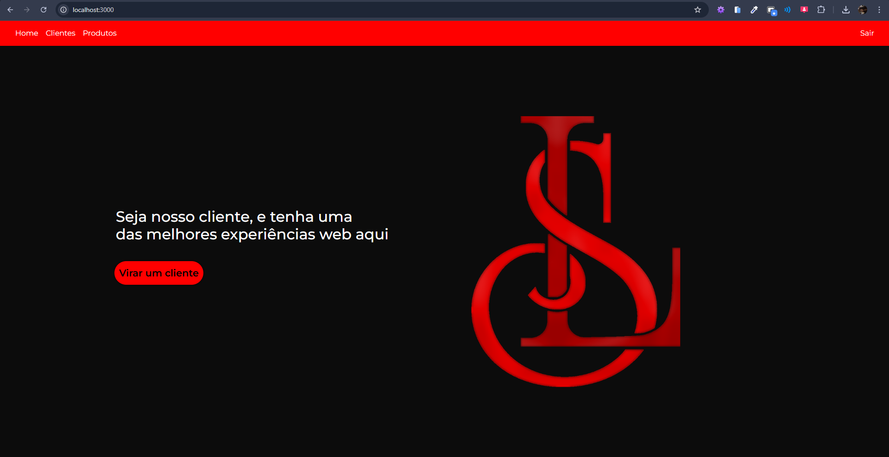
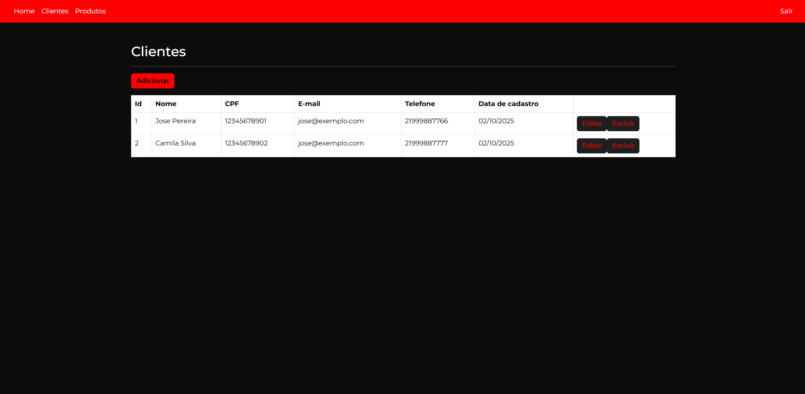

# 🎓 Projeto React

> Meu primeiro projeto em **React**, desenvolvido para a faculdade.  
> Utiliza a API do meu professor **Weberson** como backend.  

📌 API utilizada: [backend-node-exemplo-memoria](https://github.com/WebersonRodrigues/backend-node-exemplo-memoria)

---

## 📸 Preview




---

## ⚡️ Pré-requisitos

Antes de rodar o projeto, certifique-se de ter instalado:

- [Node.js](https://nodejs.org/)  
- [npm](https://www.npmjs.com/)  
- Navegador atualizado (Chrome, Edge, etc.)

---

## 🚀 Como rodar o projeto

### 🔹 1. Backend (API)

Clone o repositório da API:

```bash
git clone https://github.com/WebersonRodrigues/backend-node-exemplo-memoria.git
cd backend-node-exemplo-memoria
```
Instale as dependências:

```bash
npm i
```

```bash
npm install
```

Inicie o servidor:

```bash
npm start
```

A API estará rodando em:
👉 http://localhost:3400

## Frontend (React)

Clone este repositório:

```bash
git clone https://github.com/LaissiqueiraNT/Projeto-React.git
cd Projeto-React
```

Instale as dependências:

```bash
npm install
```

Inicie o projeto:

```bash
npm start
```